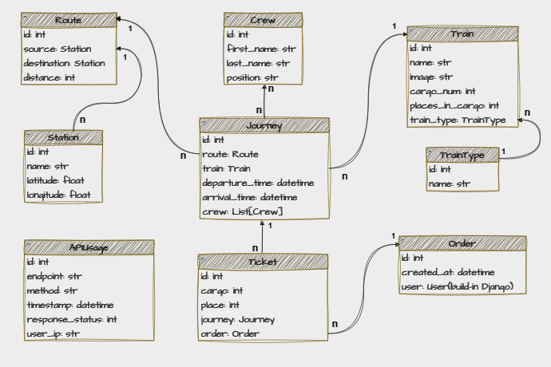
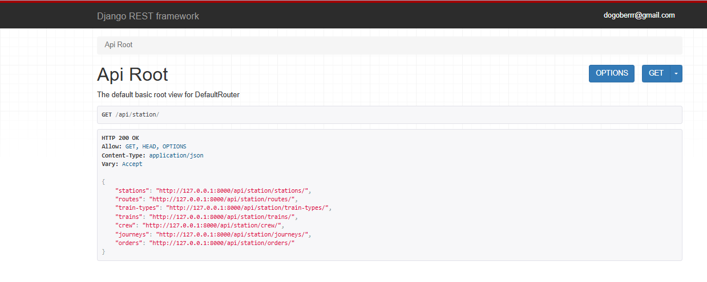

# Train Station API

## Project Description

Train Station API is a RESTful API developed using Django that provides functionality for managing train stations, routes, trains, and passengers. The API includes endpoints for creating, retrieving, updating, and deleting resources related to train operations. It also features logging for analytics purposes.

## Features

- User registration and management
- Train management (create, update, delete)
- Route management (create, update, delete)
- Station management (create, update, delete)
- Journey management (create, update, delete)
- Ticket purchasing and order management
- API usage logging for analytics
- Search and filtering capabilities for various models
- Token-based authentication using JWT

## Setup Instructions

### Local Development Setup

1. **Clone the repository**:
```shell
  git clone https://github.com/dissom/Train-Station-API-Service.git
  cd train-station-api
```

2. **Create a virtual environment**:
```shell
  python -m venv venv
  source venv/bin/activate  # On Windows use venv\Scripts\activate
```

3. **Install requirements**:
```shell
  pip install -r requirements.txt
```

4. **Create a `.env` file**:
    Ensure your `.env file includes the following variables:
```plaintext
# DB
POSTGRES_DB=
POSTGRES_DB_PORT=
POSTGRES_USER=
POSTGRES_PASSWORD=
POSTGRES_HOST=

# Django
DATABASE_TYPE=
SECRET_KEY=
```

5. **Run database migrations**:
```shell
  python manage.py migrate
```

6. **Run the development server**:
```shell
  python manage.py runserver
```

### Docker Setup

1. **Build and run the Docker containers**:
   Make sure you have Docker and Docker Compose installed, then run:
   
```shell
  docker-compose up --build
```
2. **Initial Data**:
   Initial data will be automatically loaded when the Docker containers are started. This includes two users:
   - **Admin**: Email: `admin@gmail.com`, Password: `Q1234567!`
   - **Test User**: Email: `test_user@gmail.com`, Password: `Q1234567!`

3. **Database Connection**:
   If you want to run the project in Docker, make sure to change the `DATABASE_TYPE` environment variable to `postgres`.

### Creating a Superuser

To create an admin user, you can either run the following command inside the Docker container:

```shell
  python manage.py createsuperuser
```

Or navigate to the endpoint: http://127.0.0.1:8000/api/user/register/

## API Endpoints

- **User Registration**: `POST /api/user/register/`
- **User Management**: `GET /api/user/me/`
- **Train Management**: `POST /api/train/`
- **Route Management**: `POST /api/route/`
- **Station Management**: `POST /api/station/`
- **Order Management**: `POST /api/order/`
- **API Usage Logs**: `GET /api/station/api-usage/`

## Testing

Run tests using the following command:

```shell
  python manage.py test
```

### DB diagram



### Demo


